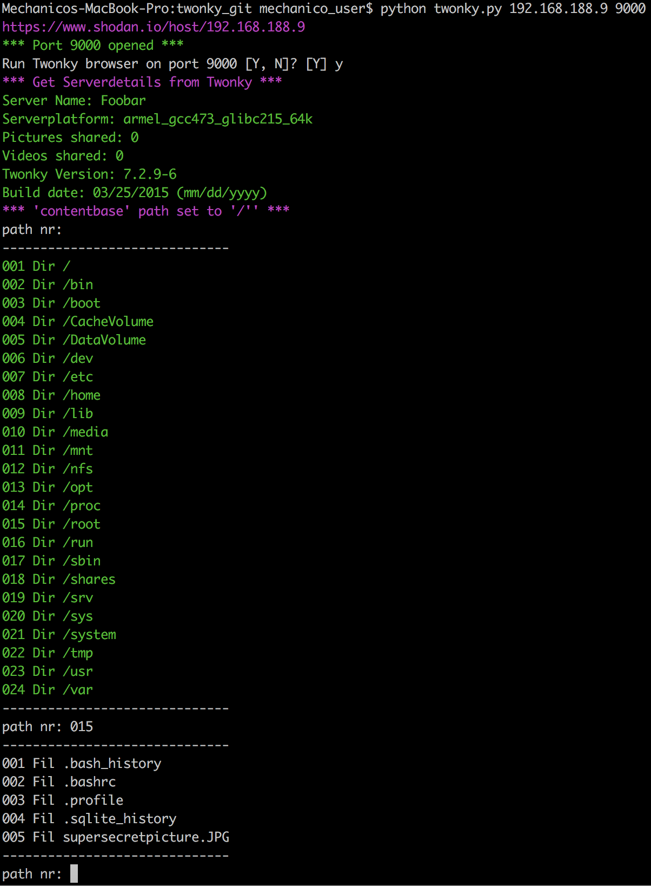

# sharingIsCaring TwonkyMedia Server Pwnd CVE-2018-7171
## Background information
This is a GitHub repository keeping all relevant information about CVE-2018-7171. (and more)

CVE-2018-7171 represents a directory/file traversal vulnerability in TwonkyMedia Server 
version 7.0.11-8.5 (latest version). Exploiting this vulnerability allows an attacker to 
list all files located on the device, that is running the TwonkyMedia Server platform independent. 
Furthermore, an attacker is able to download all media files (pictures, videos, and music) from 
a device after exploiting this vulnerability. To exploit this vulnerability TwonkyMedia Server must 
not be protected by a password (which is the default setup).

Since a huge amount, around 24'000 TwonkyMedia Server instances rarely protected by a password, 
are reachable via the internet the researcher decided to publish this vulnerability.

Maybe you don't know that TwonkyMedia Server is running on your device nor you know that it's
exposed in the internet. This is due to the fact that TwonkyMedia Server is pre-installed on
many NAS devices. Your router may automatically forward the UPnP port (e.g. 9000). This makes
the TwonkyMedia Server accessible public.

<b>If your devices are affected by this vulnerability, expect all files on your device as no longer 
private.</b>

### Countermeasures
Please make sure to switch off or protect your TwonkyMedia Server with a password, because no
fix for this vulnerability is available. 

## Disclaimer
Any actions and or activities related to the material contained within this repository is solely your 
responsibility.The misuse of the information in this repository can result in criminal charges brought 
against the persons in question. The author will not be held responsible in the event any criminal 
charges be brought against any individuals misusing the information in this repository to break the law.

Running twonky.py for attacking targets without prior mutual consent is illegal. It is the end user's 
responsibility to obey all applicable local, state and federal laws.

## Disclosure timeline
2018-01-20 Vulnerability discovered  
2018-03-28 Security advisory released

## About the PoC's
<b>twonky.py</b> can be used to comfortably browse devices running TwonkyMedia Server. 
Also, a feature is implemented which checks file and directory names against a built-in 
extensible wordlist for keywords e.g. "wallet". Furthermore, interesting system information
is requested and presented to the user. Also, if a PHPSESSID cookie is discovered (usually in /tmp/
directory) a check against the Western Digital Api is executed automatically. If successfull this
cookies value could be used to take over the WD NAS device.

<b>downloadFiles.py</b> (experimental) can be used to perform bulk downloads of TwonkyMedia Server indexed 
directories.

## About the TwonkyMedia Server
"With Twonky from Lynx Technology, you can quickly discover your media libraries of digital videos, 
photos and music in your home, control them from mobile devices, and enjoy them on connected screens and speakers.

Twonky Server is the industry leading DLNA/UPnP Media Server from Lynx Technology that enables sharing media content 
between connected devices. Twonky Server is used worldwide and is available as a standalone server 
(end user installable, e.g. for PCs/Macs) or an embedded server for devices such as NAS, routers/gateways and STBs.

Twonky Server’s web UI provides optimal capability for you to easily and reliably control and play back your 
media files in a variety of ways, and to “beam” those media files to other connected devices." --extract from https://twonky.com

### Previous similar vulnerabilities
https://packetstormsecurity.com/files/112227/PacketVideo-TwonkyServer-TwonkyMedia-Directory-Traversal.html

Fix:
https://docs.twonky.com/display/TRN/Twonky+Server+7.0.x

## Installation
```
$ git clone https://github.com/mechanico/sharingIsCaring.git
$ cd sharingIsCaring
$ sudo pip install -r requirements.txt
```

You're ready to go!

## Example usage twonky.py
Running <b>twonky.py [IP ADRESS] [PORT]</b>, will set the contentbase Parameter for the TwonkyMedia Server 
to /../ that allows from now on the discovery, indexing and download of all media files available on the 
device and connected peripherals, e.g. USB drives.



### Explanation of output
* The "path nr" is e.g. 001, 002, ...
* To browse through directories use "/" as delimiter, e.g. 005/091
* Directories are marked with "Dir"
* Directories are colored "GREEN"
* Files are marked with "Fil"
* Files are not colored
* If a Keyword is discovered the line will be colored "RED"

### What will twonky.py do?
* set contentbase parameter to /../
* collect some information on the target (e.g. how many pictures indexed, ...)
* give you the ability to browse through all directories on the target
* highlight "interesting files" red
* PHPSESSID cookie file discovery, the script will automatically test them against the WD api,
if successfull you could be able to take over the NAS device

### What will twonky.py not do?
* Download files
* Take over NAS devices automatically

## Demonstration access ALL files
The following Screenshots show how the TwonkyMedia Server can now be used to access all 
Media files available on the device e.g. in the /root directory. Be aware that 
TwonkyMedia Server is not only running on Unix but also on Windows installations all
demonstrations are applicable for multiple operation systems.


## Example usage downloadFiles.py
Step 1:
To start the bulk download of files, shared by the TwonkyMedia Server simply copy the URL of the
folder of interest:


Step 2:
Next launch <b>downloadFiles.py [PATH TO SAVE DOWNLOADS]</b>.The path parameter specifies where the 
downloaded files should be saved. Next provide the script with the TwonkyMedia Server Folder URL you copied 
previously.  Now the script creates a new folder with the IP Adress as name and automatically starts 
downloading all files inside the folder. If there are more then 30 media files, the script will show a prompt 
with the total count of media files discovered. Answer "Y", the bulk download will start.


